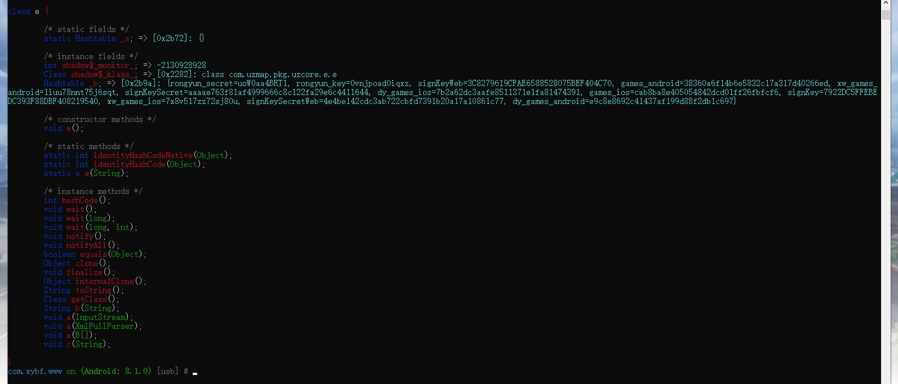

咸鱼帮扶app 是一个用第三方apiclound 集成在js上的app。

类似uni-app

js文件在安卓的资源目录下，widgets。

加密方式：`'nd-sign':hex_sha1(md5(hex_sha1(secret+'&'+uid+'&'+key+'&'+timestamp+'&'+secret)))`

secret,key 在key.xml中。这个xml做了特殊处理。

从java层分析。发现写到了hashtable中

于是，wallbreak派上用场

直接objsearch，存在就dump，可以看到hashtable的明文数据。

